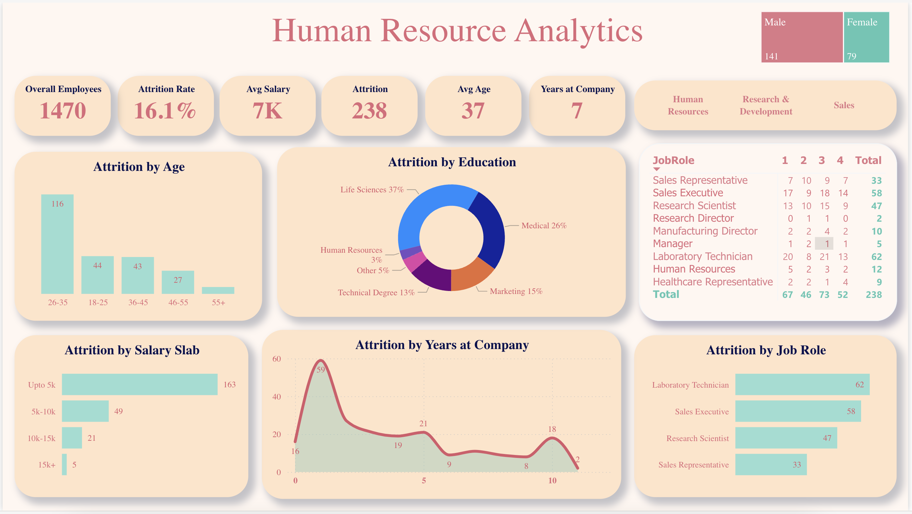

# Human Resource Analytics Dashboard

This Power BI dashboard provides a detailed analysis of key HR metrics such as employee attrition, salary distribution, and employee demographics across various departments and roles. The dashboard is designed to help HR professionals gain insights into workforce trends, identify potential areas of improvement, and make data-driven decisions.

## Dashboard Overview

[Click here to view the live Power BI dashboard](https://app.powerbi.com/groups/me/reports/cab2e326-47fc-4209-8b23-7ec81094883f/fc7fcb94808473710ed1?experience=power-bi)

### Key Metrics

1. **Attrition Rate**: The overall employee attrition rate is displayed as a percentage of the workforce.
2. **Average Salary**: Visualizes the average salary of employees across various roles.
3. **Total Employees**: Shows the total number of employees in the organization.
4. **Attrition by Job Role**: Displays attrition rates broken down by specific job roles (e.g., Sales Representatives, Research Scientists).
5. **Attrition by Salary Slab**: Analysis of attrition rates segmented by salary ranges (e.g., under 5K, 5K-10K, 10K-15K, etc.).
6. **Attrition by Age Group**: Shows how attrition varies among different age brackets (e.g., 18-25, 26-35, 36-45, etc.).
7. **Attrition by Education**: Breaks down attrition based on employees' educational backgrounds (e.g., Life Sciences, Medical, Technical Degree).
8. **Attrition by Years at Company**: Displays how attrition correlates with employees' tenure at the company.

### Dashboard Features

- **Attrition by Job Role**: Analyze how different job roles contribute to overall employee turnover. The dashboard highlights the top roles with the highest attrition rates, such as Laboratory Technicians and Sales Executives.
  
- **Attrition by Salary Slab**: A detailed breakdown of attrition rates across various salary ranges, allowing HR teams to understand if salary is a key factor contributing to turnover.

- **Attrition by Years at Company**: Provides insights into employee tenure and how it relates to attrition, helping identify when employees are most likely to leave the organization.
  
- **Demographic Breakdown**: Visualizes employee demographics such as gender distribution and age, offering insights into workforce composition.

- **Education and Attrition Correlation**: Breaks down attrition rates based on educational qualifications, allowing HR to understand how education impacts employee retention.

## How to Use the Dashboard

1. **Filters**: Use available filters to drill down into specific departments, age groups, or educational backgrounds for a more focused analysis.
2. **Interactive Charts**: Hover over charts and visualizations to reveal detailed insights and specific data points related to employee attrition.
3. **Compare Metrics**: The dashboard allows comparisons across various departments, job roles, and salary ranges to better understand patterns in employee turnover.

## Data Sources

The dashboard is powered by HR data that includes:
- **Employee Demographics**: Age, gender, education, job role.
- **Salary Information**: Salary ranges and averages.
- **Attrition Data**: Employee attrition rates by department, role, age group, and education.
- **Employee Tenure**: Information on how long employees have been with the company.

## Visualizations

- **Bar Charts**: Used to show attrition by job role, salary, and years at the company.
- **Pie Charts**: Used for attrition by education and demographic breakdowns.
- **Line Charts**: Display attrition over time, segmented by years at the company.

## Technology Stack

- **Power BI**: Interactive visualizations built using Microsoft Power BI.
- **Data Sources**: HR data from internal systems, such as employee records, salary information, and turnover reports.

## Getting Started

To explore the dashboard:
1. Click the [live dashboard link](https://app.powerbi.com/groups/me/reports/cab2e326-47fc-4209-8b23-7ec81094883f/fc7fcb94808473710ed1?experience=power-bi).
2. Use the available filters to explore specific segments of the workforce (e.g., by job role or department).
3. Hover over visualizations to get detailed data points and insights into employee attrition patterns.

## Contributing

If you would like to contribute to the development or enhancement of this dashboard:
1. Fork the repository.
2. Make your changes to the `.pbix` file.
3. Submit a pull request with your changes and improvements.

## License

This project is licensed under the MIT License. See the `LICENSE` file for more details.

---

### Dashboard Preview

